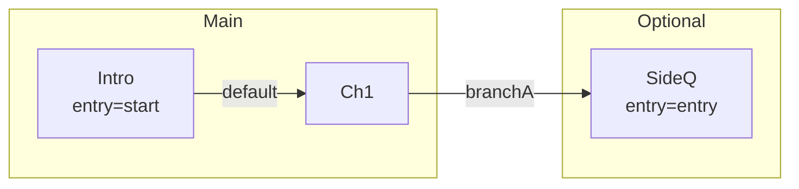

# Timeline Scripting

This document describes the Timeline DSL used by the Editor to organize visual-novel arcs (VNS scripts), their entry labels, spatial layout, clusters, and links between arcs.

The timeline is saved as `story.timeline` alongside your project, and can be edited visually (graph) or as text (Timeline editor).

## Quickstart

- Create a minimal `story.timeline` at your project root:
  ```
  arc "Intro" script "game/scripts/demo.vns" entry "start" at 40,40
  arc "Chapter1" script "game/scripts/ch1.vns" at 260,40
  link Intro -> Chapter1
  ```
- Open the Editor and load your project folder (see `docs/Editor.md`).
  - Switch to the Timeline view to see arcs and links.
  - Drag nodes to arrange, assign clusters, and add more links.
- Author the referenced `.vns` files; see `docs/VNS Scripting.md`.
- If you launch JES scenes from VNS, see `docs/JES Scripting.md`.

## Core concepts

- **Arc**
  - A node representing a VNS script (`.vns`) and an optional entry label inside that script.
  - Has a position (`at x,y`) for layout and an optional `cluster` name for grouping.
- **Link**
  - A directional connection from one arc to another, optionally specifying labels on either side.
  - If the target label is omitted, the destination arc’s `entry` is used when present.
- **Cluster**
  - A named group used to visually group arcs, color them, and support collapse/filter operations in the graph.

## Syntax

### Arc declaration

```
arc "ArcName" script "path/to/script.vns" entry "optionalLabel" cluster "optionalCluster" at X,Y
```

- `ArcName` is required and must be unique.
- `script` is recommended (relative to project root or absolute path).
- `entry` is optional; if present, it should be an existing label in the VNS script.
- `cluster` is optional; used by the graph for coloring, collapse, and filtering.
- `at X,Y` persists the node position in the graph. Use integers or decimals.

Examples:

```
arc "Intro" script "game/scripts/demo.vns" entry "start" at 40,40
arc "Chapter1" script "game/scripts/ch1.vns" cluster "Main" at 260,40
arc "SideQuest" script "game/scripts/side.vns" cluster "Optional" at 260,180
```

### Link declaration

```
link FromArc[:FromLabel] -> ToArc[:ToLabel]
```

Examples:

```
link Intro -> Chapter1
link Chapter1:branchA -> SideQuest:entrySide
```

Notes:
- If `:FromLabel` is omitted, the link originates from the arc’s flow (usually the script position that triggers the transition).
- If `:ToLabel` is omitted, the destination label defaults to the destination arc’s `entry` (if set).

## Validation

- When validating the timeline:
  - Every arc with a `script` must point to a file that exists.
  - `entry` labels must exist in the referenced `.vns` file.
  - Link targets must reference an existing arc, and the final target label must exist (either explicit `:ToLabel` or the arc’s `entry`).
- Timeline editor underlines unresolved tokens and offers quick-fixes:
  - Missing arc in a `link`: Create arc …, or Change to existing…
  - Missing label: Change to existing label… (labels are read from the referenced `.vns` file)

## Editor features and tips

- Drag from a node’s out-handle to another node’s in-handle to create links.
- Clusters:
  - Backgrounds are color-coded by cluster name.
  - Double-click a cluster background or use its menu to collapse/expand.
  - Use the toolbar Cluster filter to view only one cluster.
- Search field highlights arcs by name.
- Auto Layout arranges nodes in a grid. Fit scales the graph to view.
- Drag-and-drop `.vns` files from Finder onto the graph to create arcs quickly.

## Persistence

- The editor saves the human-readable DSL described above.
- It also supports legacy lines internally (`ARC|…` and `LINK|…`) for backward compatibility, but new content should use the DSL shown in this document.

## Minimal example

```
arc "Intro" script "game/scripts/demo.vns" entry "start" cluster "Main" at 40,40
arc "Chapter1" script "game/scripts/ch1.vns" cluster "Main" at 260,40
arc "Side" script "game/scripts/side.vns" cluster "Optional" at 260,180

link Intro -> Chapter1
link Chapter1:branchA -> Side:entrySide
```

## Example project

You can examine a working setup under `demo-game/`:

- Scripts: `demo-game/src/main/resources/game/scripts/*.vns`
- Example timeline file: create `story.timeline` at the project root with content like:

```
arc "Intro"    script "game/scripts/demo.vns" entry "start" cluster "Main"   at 40,40
arc "Ch1"      script "game/scripts/ch1.vns"   cluster "Main"   at 260,40
arc "SideQ"    script "game/scripts/side.vns"  cluster "Optional" at 260,180

link Intro -> Ch1
link Ch1:branchA -> SideQ:entry
```

Open the editor, load the project root, and use the Timeline view to see these arcs and links. Drag nodes around, collapse clusters, and filter by cluster using the toolbar.

## Diagrams

Below is a conceptual diagram of a small timeline (requires Mermaid support):



Legend:

- Default arrow: no explicit `:label` on the right side; uses target arc `entry`.
- Labeled arrow: `link From:label -> To:label`.
