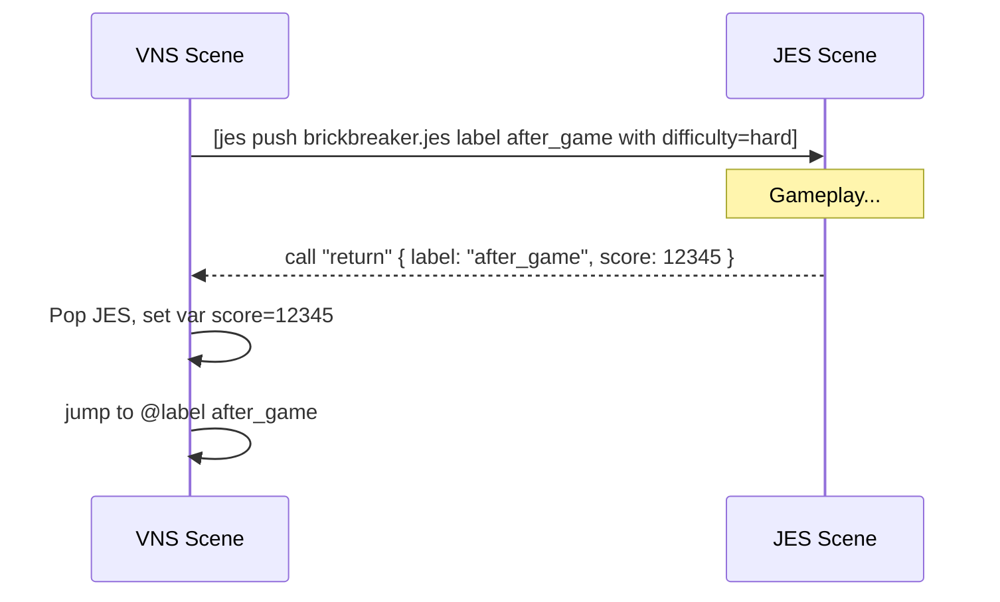

# VNS Scripting

This document describes the Visual Novel Script (VNS) format used by the engine and editor. VNS is a readable, line-based DSL parsed by the engine into runtime scenarios.

The parser lives at `core/src/main/java/com/jvn/core/vn/script/VnScriptParser.java`. All syntax below is based on its implementation.

## File structure overview

- Lines are read top-to-bottom.
- Blank lines and lines starting with `#` are ignored (comments).
- Scripts typically begin with `@scenario` and resource definitions, then labels, dialogue, choices, and commands.

```vns
# Comment
@scenario my_story
@character alice "Alice"
@character bob   "Bob"
@background room game/images/bg_room.png

@label start
[background room]
Alice: Hello!
> Nice to meet you -> greet
> Maybe later

@label greet
Bob: Welcome.
[end]
```

## Declarations

### Scenario
```
@scenario <id>
```
- Declares or sets the scenario id. If omitted, defaults to `untitled`.

### Characters
```
@character <id> "Display Name"
```
- Registers a character id and display name.

### Backgrounds
```
@background <id> <path>
```
- Registers a background resource by id, with an image path.

### Labels
```
@label <name>
```
- Marks a jump target and a logical section of the script.
- Timelines may link to labels by name.

## Dialogue
```
<Speaker>: <text>
```
- Emission of dialogue attributed to `<Speaker>`.
- Example:
```
Alice: This is a line of dialogue.
```

## Choices
```
> <choice text> [-> <targetLabel>]
```
- Creates a menu choice. If `-> <targetLabel>` is present, choosing this option jumps to that label.
- Conditional choices can be written inline with a trailing condition in brackets appended to the choice text:
```
> Explore the cave [if flags.cave_open]
> Open the door -> entry [if stats.strength > 5]
```
- The parser recognizes the pattern `... [if <expr>]` at the end of the choice text and treats `<expr>` as a display condition.

## Commands

Commands are enclosed in square brackets:
```
[command arg...]
```
Supported commands:

- Background scene
```
[background <bgId>]
[bg <bgId>]
```

- Jumps and flow
```
[jump <label>]
[end]
```

- Audio
```
[bgm <path-or-id>]     # plays and loops BGM
[bgm_stop]             # stops BGM
[bgm_fadeout [<ms>]]   # fades out BGM over <ms>; if omitted or 0 → stop immediately
[sfx <path-or-id>]     # plays SFX once
[voice <path-or-id>]   # plays voice (dedicated voice channel when available; falls back to SFX)
```

- Timing
```
[wait <millis>]
```

- Character sprites
```
[show <charId> <pos> [expression]]
[hide <charId>]
```
  - Positions: `LEFT, CENTER, RIGHT, FAR_LEFT, FAR_RIGHT` and short forms `L, C, R, FL, FR`.
  - Expression is free-form (e.g., `happy`, `neutral`).

- Scene transitions
```
[transition <type> [durationMs] [bgId]]
```
  - Types: `NONE, FADE, DISSOLVE, CROSSFADE, SLIDE_LEFT, SLIDE_RIGHT, WIPE` (case-insensitive).
  - Duration defaults to 500ms when omitted.
  - Optional background id can be provided to transition to a new background.

- External calls / integration
```
[menu <payload>]
[settings]
[mainmenu [payload]]
[load <scriptPathOrId>]      # external: vns replace
[goto <label>]               # external: vns goto
[set <expr>]                 # external: var set
[inc <expr>]                 # external: var inc
[dec <expr>]                 # external: var dec
[flag <expr>]                # external: var flag
[unflag <expr>]              # external: var unflag
[clear <expr>]               # external: var clear
[if <expr>]                  # external: cond if
[call <provider> <payload>]
[jes <payload>]              # shortcut for [call jes <payload>]
[java <payload>]             # shortcut for [call java <payload>]
```

## Player settings and modes

These commands adjust runtime behavior while a VN is playing.

- Text and auto-play
```
[textspeed <msPerChar>]
[autodelay <msBetweenLines>]
```

- Volumes (0.0 .. 1.0)
```
[volume bgm <v>]    # e.g., [volume bgm 0.6]
[volume sfx <v>]
[volume voice <v>]
```

- Modes
```
[skip [on|off|toggle]]   # default: toggle
[auto [on|off|toggle]]   # default: toggle
```

- UI and history
```
[ui [hide|show|toggle]]           # toggle if omitted
[history [toggle|show|hide]]
[history scroll <lines>]          # positive = older, negative = newer
[history clear]                   # reset scroll offset
```

- Save/load helpers
```
[save]                 # quick save
[quickload]            # quick load (if available)
```

- HUD message
```
[hud <message>]
```

Notes:
- `menu`, `settings`, `mainmenu`, `load`, `goto`, and variable/condition ops are routed as external calls to the runtime. Exact behaviors depend on the runtime integration.
- `load` replaces the current script (e.g., load another `.vns`).
- `goto` jumps to a label, often used in cooperation with Timelines.
- `textspeed`, `autodelay`, and `volume` update the live `VnSettings` during playback.
- `skip` and `auto` are mutually exclusive; enabling one disables the other.
- `voice` currently uses the SFX channel under the hood.

## Best practices

- Keep label names descriptive and stable so timelines and links remain valid.
- Organize resources with `@background` and `@character` at the top of the file.
- Use `wait` and `transition` to pace scenes and add visual polish.
- Use conditional choices (`[if ...]`) for branching based on game state.

## Example

```vns
# Simple example
@scenario demo
@character alice "Alice"
@character bob   "Bob"
@background room game/images/bg_room.png

@label start
[bg room]
Alice: Hey there!
> Greet Bob -> greet
> Leave

@label greet
Bob: Nice to meet you.
[transition fade 600]
[end]
```

## Interop with Timelines

- Timelines reference VNS scripts and can specify an `entry` label.
- A timeline `link` to `ArcB` without an explicit `:label` will default to `ArcB`’s `entry` if defined.
- From within VNS, you can also instruct the runtime to `goto` a timeline arc/label if your game flow requires it:
```
[goto ArcB:optionalLabel]
```

This document reflects the parser’s supported constructs; if you add new commands to `VnScriptParser`, update this guide accordingly.

## JES interop from VNS

You can launch JES scenes (e.g., minigames) mid-VN and return with results.

- Launching a JES scene
```
[jes push <script.jes> [label <returnLabel>] [with k=v ...]]
[jes replace <script.jes> [label <returnLabel>] [with k=v ...]]
[jes pop]
[jes call <name> k=v ...]         # calls into the active JES scene
```

- Convenience shortcuts
```
[jes_push <script.jes>]
[jes_replace <script.jes>]
[jes_pop]
[jes_call <name> k=v]
```

- Returning to VNS from JES
  - In JES, call `return` (or `vns`) with optional props. Runtime will:
    - Pop the JES scene.
    - Copy props into VN variables (except `label`/`goto`).
    - Jump to `label` (from props) or to the `label` specified in the `[jes push ... label L]` call.

Notes:
- Prop parsing for `with k=v` and `[jes call <name> k=v ...]` auto-coerces values:
  - `true/false` → boolean
  - numbers with `.` → double; integers otherwise
  - anything else → string
- Values cannot contain spaces; for multi-word values, encode them (e.g., `title=Hello_World`).

### End-to-end example

VNS script:
```vns
@label start
Alice: Let’s play a quick minigame!
[jes push game/minigames/brickbreaker.jes label after_game with difficulty=hard lives=3]

@label after_game
Alice: Welcome back!
Alice: (The minigame stored your score in a VN variable named "score".)
> Try again -> start
> Continue
```

JES script snippet (inside the game):
```jes
// When the game ends
call "return" { label: "after_game" score: 12345 }
```

### Diagram



## Example project

See `demo-game/src/main/resources/game/scripts/` for `.vns` examples such as `demo.vns`. A minimal layout:

```
@scenario demo
@character alice "Alice"
@background room game/images/bg_room.png

@label start
[bg room]
Alice: Welcome!
> Greet -> greet
> Leave

@label greet
Alice: Nice to meet you.
[end]
```

## Diagrams

Conceptual label flow for the example (requires Mermaid support):

```mermaid
flowchart TD
  start[[@label start]] -->|choice: Greet| greet[[@label greet]]
  start -->|choice: Leave| end1([end])
  greet --> end2([end])
```
